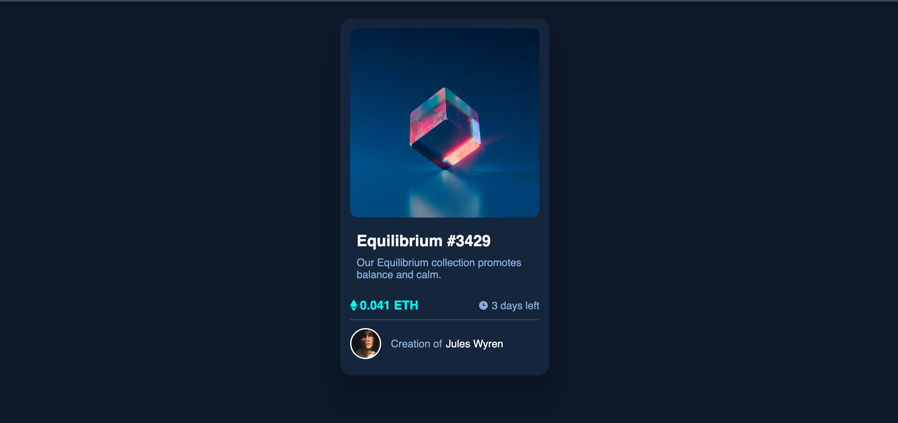

# Frontend Mentor - NFT preview card component solution

This is a solution to the [NFT preview card component challenge on Frontend Mentor](https://www.frontendmentor.io/challenges/nft-preview-card-component-SbdUL_w0U). Frontend Mentor challenges help you improve your coding skills by building realistic projects. 

## Table of contents

- [Overview](#overview)
  - [The challenge](#the-challenge)
  - [Screenshot](#screenshot)
  - [Links](#links)
- [My process](#my-process)
  - [Built with](#built-with)
  - [What I learned](#what-i-learned)
  - [Continued development](#continued-development)
  - [Useful resources](#useful-resources)
- [Author](#author)
- [Acknowledgments](#acknowledgments)

## Overview

### The challenge

Users should be able to:

- View the optimal layout depending on their device's screen size
- See hover states for interactive elements

### Screenshot

### Links

- Solution URL: [Add solution URL here](https://your-solution-url.com)
- Live Site URL: [Add live site URL here](https://your-live-site-url.com)

## My process

### Built with

- Semantic HTML5 markup
- CSS custom properties
- Flexbox

### What I learned

i learned how to use flexbox and gap in css,i also learnt how to use hover in css and some html tips
To see how you can add code snippets, see below:

h2:hover{
    color: cyan;
}

### Continued development

i want to learn more about flex box 

### Useful resources

- [Example resource 1]https://www.youtube.com/watch?v=9bGbykdR4T8 - This helped with list. I really liked this pattern and will use it going forward.
- [Example resource 2]https://www.youtube.com/watch?v=DpGEOcgcHeA - this helped me with hover

## Author

- Website - oke kolade
- Frontend Mentor - [@oluwakolade]https://www.frontendmentor.io/profile/oluwakolade

## Acknowledgments

https://www.youtube.com/watch?v=9bGbykdR4T8
https://www.youtube.com/watch?v=DpGEOcgcHeA
these are the videos i watched to gain some understanding on the project

